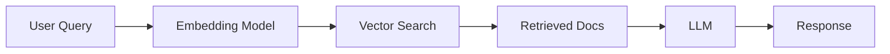

# Example Project: AI RAG Chatbot

This is an example of how you'd document one of your projects in Docusaurus.

## Overview

A production-ready RAG chatbot using open-source LLMs.

**Tech Stack:**
- Python
- LangChain
- FAISS
- Ollama

**Status:** ⭐ 2 stars | 🟢 Active

---

## Installation

```bash
git clone https://github.com/ly2xxx/rag_chat_opensource_llm
cd rag_chat_opensource_llm
pip install -r requirements.txt
```

## Quick Start

```python
from rag_chat import RAGChatbot

bot = RAGChatbot(
    model="llama3",
    vector_db="faiss"
)

response = bot.query("What is RAG?")
print(response)
```

## Features

### ✅ Vector Search
Uses FAISS for fast similarity search across document embeddings.

### ✅ Local LLMs
Runs entirely offline with Ollama - no API costs!

### ✅ Customizable
Easy to swap models, add documents, tune retrieval.

---

## Architecture



:::tip Pro Tip
Use this pattern for **any** project documentation! Each project gets its own page.
:::

:::warning Important
For a catalog of 53 projects, this would mean **53 markdown files** to maintain. That's why Jekyll Collections is better for catalogs!
:::

---

## Related Projects

- [agents](https://github.com/ly2xxx/agents) - LangGraph agents
- [aidev](https://github.com/ly2xxx/aidev) - AI dev team

---

## Learn More

- [GitHub Repo](https://github.com/ly2xxx/rag_chat_opensource_llm)
- [Blog Post](#)
- [Tutorial Series](#)
